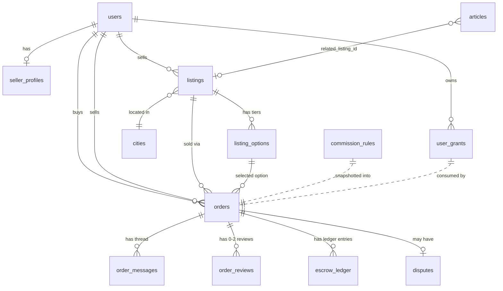

# Locore マーケットプレイス進化 — 詳細 PRD

> 海外在住日本人向け「スキル・人脈マーケットプレイス」への進化のための、実装着手レベルの設計ドキュメント。
>
> 上位ブリーフ: [`docs/marketplace-brief.md`](./marketplace-brief.md)（事業判断のソース）
> 関連: `packages/db/migrations/manual/0052_marketplace_schema.sql`（スキーマ実装）

---

## 0. ドキュメント・マップ

| 章 | 内容 | 読み手 |
|---|---|---|
| §1 | Executive Summary | 全員 |
| §2 | 現在の Locore との関係 | PM / 設計者 |
| §3 | エンティティモデル | 実装 |
| §4 | Order State Machine | 実装・運営 |
| §5 | Stripe Connect パイプライン | 実装 |
| §6 | 料率エンジン | 実装・PM |
| §7 | 価格モデル | 実装・PM |
| §8 | メッセージング・マスキング | 実装・運営 |
| §9 | レビュー設計 | 実装・PM |
| §10 | 紛争処理 | 運営 |
| §11 | 創業メンバー権利 | PM |
| §12 | 多通貨 | 実装 |
| §13 | Creator-centric Integration | 実装・編集・PM |
| §14 | UI ページ一覧 | 実装・デザイン |
| §15 | 段階リリース計画 | 経営 |
| §16 | 未決事項 | 経営・法務 |
| §17 | 旧スキーマ差分 | 実装 |

---

## 1. Executive Summary

Locore は **2026/05/22 に MOC を公開する旅行記事マーケットプレイス**。本ドキュメントは、そこから **「海外在住日本人による現地スキル・人脈の取引プラットフォーム」** へ進化させるための詳細 PRD。

- **誰のために**: 海外在住の日本人（売り手）／日本側の個人・企業／現地を訪れる旅行者／現地の同胞（買い手）。
- **何を作るか**: Stripe Connect Express を介したエスクロー型取引、料率 10–15% を中心とした手数料エンジン、双方向レビュー、紛争処理、連絡先マスキング付きメッセージング、創業メンバー優遇。
- **なぜ**: パリ等の既存掲示板は「発見」レイヤーしか提供しておらず、決済・信頼・紛争の空白を埋めれば手数料を取れる構造的優位がある。
- **いつまでに**: 2026 Q3 末（8 週間） に β を出す。最初の看板は「買付・発送代行」と「アクセス・コーディネート」の **両方**。
- **既存資産との共存**: 旅行記事マーケット（paywall）は撤去せず、**Listing と並走** する。記事は集客窓口、Listing は決済導線。

---

## 2. 背景：現在の Locore と marketplace-brief の関係

### 2.1 現状（MOC 時点）

- 28 テーブル、Drizzle ORM + Supabase Postgres。
- 主要ドメイン: `articles`（旅行記事、無料/有料 split）／`purchases`（記事の単発購入）／`reviews`（記事レビュー）／`user_services`（無料の "名刺ページ" レベルの出品）／`community_posts`（駐在員向け掲示板）。
- 決済は記事購入用に Stripe（platform 単独 charge）が動いている。Connect は **未接続**。

### 2.2 brief が要求する変化

ブリーフ（`docs/marketplace-brief.md`）の §10 が示す要件:

| 機能 | 現状 | 必要 |
|---|---|---|
| エスクロー | × | ◯ Stripe Connect Separate Charges & Transfers |
| 料率エンジン | × | ◯ カテゴリ / リピート / 創業 / 上限 |
| 双方向レビュー | △（片方向のみ） | ◯ 取引コンテキスト |
| メッセージング | △（自由チャット） | ◯ 取引スレッド + マスキング |
| 多通貨 | △（EUR/JPY 表示のみ） | ◯ 出品者通貨決済 |
| KYC | × | ◯ Connect 経由 + 運営審査 |

### 2.3 共存方針

1. **記事マーケットは維持**。paywall・purchases・reviews はそのまま。
2. **新しい "出品" は listings に集約**。`user_services` は段階的に listings に移行（§17 で詳細）。MOC 後の追記である一方、API 互換のため当面は残置。
3. **articles ↔ listings は 1:N の関連**。記事末尾に Listing カードを差し込む（§13）。
4. **掲示板 (community_posts) は別レイヤー**。決済を伴わない雑談・募集はそちらで継続。

---

## 3. エンティティモデル

### 3.1 新規 10 テーブル一覧

| # | テーブル | 役割 | 主キー |
|---|---|---|---|
| 1 | `seller_profiles` | 出品者プロフィール + Connect + KYC | `user_id` |
| 2 | `listings` | 出品（取引可能） | `id` |
| 3 | `listing_options` | 階層オプション / tier | `id` |
| 4 | `orders` | 取引のメイン | `id` |
| 5 | `order_messages` | 取引スレッド | `id` |
| 6 | `order_reviews` | 双方向レビュー | `id` |
| 7 | `commission_rules` | 料率エンジン設定 | `id` |
| 8 | `escrow_ledger` | エスクロー台帳 | `id` |
| 9 | `user_grants` | 創業 / 紹介特典 | `id` |
| 10 | `disputes` | 紛争 | `id` |

### 3.2 主要フィールド（要約）

実コード: `packages/db/src/schema/{seller_profiles, listings, listing_options, orders, order_messages, order_reviews, commission_rules, escrow_ledger, user_grants, disputes}.ts`

#### listings（出品）
- `seller_id`, `title`, `summary`, `description`, `category`（enum 22 種、§3 のブリーフ分類に対応）
- `pricing_model`: `fixed | hourly | daily | per_item | quote_only | tiered`
- `price_amount_minor` + `price_currency`（minor unit + ISO 4217）
- `price_range_min/max_minor`（quote_only のときの参考レンジ）
- `min_quantity / max_quantity`
- `delivery_mode`: `in_person | online | shipping | hybrid`
- `cover_image_url`, `gallery_images jsonb`, `faq jsonb`
- `status`: `draft | pending_review | published | paused | archived`

#### orders（取引）
- `order_number`（"LOC-2026-000123" のヒューマンリーダブル ID）
- `buyer_id`, `seller_id`, `listing_id`, `listing_option_id`
- `listing_snapshot jsonb`（後日の表示・紛争用）
- `status`（11 種 enum、§4）
- 金額系 7 列（subtotal / platform_fee / tax / total / seller_net）すべて minor unit
- `currency`（seller payout 通貨）
- `commission_rule_snapshot jsonb`（その時点の料率ルール）
- `buyer_display_currency / amount / fx_rate`（買い手側の表示換算）
- `repeat_index`（同一 buyer×seller の累計取引回数）
- Stripe 連携: `stripe_payment_intent_id / charge_id / transfer_id / refund_id`
- 状態タイムスタンプ: `accepted_at / paid_at / completed_at / released_at / cancelled_at / refunded_at / declined_at`
- 自動遷移期限: `auto_release_at / auto_decline_at`

#### order_messages
- `actor`: `buyer | seller | system | admin`
- `body_raw`（運営閲覧用）と `body_masked`（表示用）の 2 系統
- `moderation_flag`（none / email_masked / phone_masked / sns_handle_masked / url_masked / circumvention_phrase / multiple）
- `system_event`（"order_accepted" 等の構造化イベント）

#### commission_rules
- `kind`: `founder_grant | repeat_discount | category_base | global_cap | promotion`
- `category`（category_base のときのみ）
- `priority`（小さい数値が先）、`active_from / until`
- `params jsonb`（kind ごとの可変）

#### escrow_ledger（台帳）
- append-only。`entry_type`: `charge | hold | transfer | platform_fee | stripe_fee | refund_full | refund_partial | adjustment`
- 修正は新規行（`adjustment`）で表現、UPDATE はしない

#### user_grants
- `grant_type`: `founder_50 | founder_half | referral_bonus | manual_override`
- `scope`: `seller | buyer | both`
- `remaining_uses`（NULL = 無制限）、`status`: `active | consumed | expired | revoked`

#### disputes
- `initiator_role`: `buyer | seller`
- `reason`: 7 種 enum
- `evidence jsonb`（添付 URL の配列）
- `status`: `open / investigating / awaiting_party / resolved_*` 7 種
- `platform_fee_outcome`: `keep | waive | half`

### 3.3 既存テーブルの変更

- `users.stripe_connect_account_id text`（追加。Connect 開設の有無を高速判定するため denormalized）
- `articles.related_listing_id uuid REFERENCES listings(id) ON DELETE SET NULL`（追加。記事末尾の Listing 差し込み用）
- `user_services` → スキーマは現状維持。UI 側で「listings に移行しませんか」と促す。MVP+1 で本格 deprecate。

### 3.4 ER 図（簡易 / Mermaid）



---

## 4. 取引ライフサイクル（Order State Machine）

### 4.1 状態遷移図

```
                                  (seller decline)
   [requested] -- decline ----> [declined]   (terminal failure)
       |
       | seller accept
       v                          (buyer cancel pre-pay)
   [accepted] ---- cancel -----> [cancelled]  (terminal failure)
       |
       | buyer pays (PaymentIntent succeeded)
       v
   [paid] (= エスクロー保留)
       |
       | schedule slot agreed (任意; 即時実行型 listing は省略)
       v
   [scheduled]
       |
       | actual service starts
       v
   [in_progress]
       |
       | seller marks complete
       v
   [completed]  -- (48h タイマー) --> auto release
       |
       | buyer release  OR  auto release
       v
   [released]  (terminal success: Transfer 実行済)

   (paid 以降の任意状態) -- dispute open -----> [disputed]
   [disputed] -- admin resolve_release ------> [released]
   [disputed] -- admin resolve_refund_full --> [refunded]
   [disputed] -- admin resolve_refund_partial -> [released] + partial refund ledger
```

### 4.2 遷移表

| 遷移 | actor | 前提 | 副作用 |
|---|---|---|---|
| `requested → accepted` | seller | listing.published, seller.accepting | `accepted_at` 記録、`auto_decline_at` クリア、buyer に通知 |
| `requested → declined` | seller / system | system は 72h 超 | terminal、buyer 通知、resi なし |
| `accepted → paid` | system (Stripe webhook) | PaymentIntent succeeded | `paid_at`、escrow_ledger に `charge` + `hold` 行、`auto_release_at` は未設定 |
| `accepted → cancelled` | buyer / seller | 決済前のみ | terminal、Stripe には何も飛ばない |
| `paid → scheduled` | buyer + seller 同意 | チャットで日時確定 | `scheduled_start/end` 設定 |
| `paid → in_progress` | seller | scheduled でも paid でも OK | サービス当日「開始」ボタン |
| `in_progress → completed` | seller | | `completed_at`、`auto_release_at = now + 48h` |
| `completed → released` | buyer | | `released_at`、Stripe Transfer 実行、escrow_ledger に `transfer` + `platform_fee` |
| `completed → released` | system | now ≥ auto_release_at | 同上、actor='system' |
| `any (paid〜completed) → disputed` | buyer / seller | dispute レコード作成 | `auto_release_at` クリア |
| `disputed → released / refunded` | admin | dispute resolved | ledger 更新 |

### 4.3 自動遷移バッチ

毎 5 分の cron で:
1. `status='requested' AND auto_decline_at < now()` → `declined` に遷移、actor='system'
2. `status='completed' AND auto_release_at < now() AND disputes 無し` → `released`、Stripe Transfer 実行

部分インデックス `orders_auto_release_idx WHERE status='completed'` と `orders_auto_decline_idx WHERE status='requested'` を使い、フルスキャンを避ける。

### 4.4 不変条件 (DB 制約)

- `buyer_id <> seller_id`（CHECK）
- `amount_total_minor >= 0`、`quantity > 0`（CHECK）
- 二重 release / 二重 refund は orders.status が terminal なら以後の遷移を拒否（アプリ層トランザクション）

---

## 5. Stripe Connect Express パイプライン

### 5.1 採用モデル

**Separate Charges and Transfers**:
- 買い手 → Platform への charge（PaymentIntent、自社 Stripe アカウント）
- Platform 内で資金保留（実体は Platform balance に積まれる、Locore がエスクロー責任を負う）
- 完了承認後に Platform → Seller の Connect Express への Transfer

理由:
- application_fee 自動分配（Destination Charge）は便利だが、**「48h 後の release」「partial refund + partial transfer」「紛争での platform_fee 放棄」** など Locore 固有のロジックを表現しづらい。
- Separate なら全イベントを自社で順序制御できる。

### 5.2 主要 API 呼び出し

```
== Onboarding ==
POST /v1/accounts                  type=express, country=FR/JP, capabilities=transfers
POST /v1/account_links             type=account_onboarding (returns hosted URL)
GET  /v1/accounts/:acct            -> charges_enabled / payouts_enabled を seller_profiles に反映

== Order paid ==
POST /v1/payment_intents
  amount         = orders.amount_total_minor
  currency       = orders.currency
  customer       = buyer の Stripe Customer
  capture_method = 'automatic'
  metadata       = { order_id, listing_id, buyer_id, seller_id }
  ※ application_fee_amount や transfer_data は付けない（後で別 Transfer する）

webhook payment_intent.succeeded
  -> orders.status = 'paid'
  -> escrow_ledger に entry_type='charge'
  -> escrow_ledger に entry_type='hold' (帳簿ミラー)

== Release (completed → released) ==
POST /v1/transfers
  amount         = orders.amount_seller_net_minor
  currency       = orders.currency
  destination    = seller.stripe_connect_account_id
  source_transaction = orders.stripe_charge_id  (任意、トレーサビリティ)
  metadata       = { order_id }

  -> orders.stripe_transfer_id, status='released'
  -> escrow_ledger: entry_type='transfer' (− amount_seller_net)
  -> escrow_ledger: entry_type='platform_fee' (+ amount_platform_fee)
  -> escrow_ledger: entry_type='stripe_fee'  (− Stripe 取得分)

== Refund full ==
POST /v1/refunds
  payment_intent = orders.stripe_payment_intent_id
  reason         = 'requested_by_customer'

  -> escrow_ledger: entry_type='refund_full'
  -> orders.status='refunded'

== Refund partial（紛争で部分返金 + 部分 release）==
POST /v1/refunds              amount=部分返金額
POST /v1/transfers            amount=売り手取得分
  -> ledger: refund_partial + transfer + platform_fee
  -> orders.status='released'  (実質的に終わり)

== Stripe Dispute (chargeback) ==
webhook charge.dispute.created
  -> Locore 側 disputes に system 起点で行を作る
  -> orders.status='disputed', auto_release_at クリア
  -> 証拠提出は admin UI 経由で POST /v1/disputes/:id evidence
```

### 5.3 エスクロー保留中の資金管理

- Platform balance に滞留する。Stripe は 7 日決済（standard payout）なので、Platform 側 payout を **手動 / 月次** に変更する（auto-payout を切る）。
- 月次レポート: `escrow_ledger` を集計して
  - 保留中の charge（hold − transfer − refund）
  - 確定 platform_fee（収益）
  - 月次 Stripe fee
  を出す。

### 5.4 税務上の取り扱い（要法務確認・§16）

- Locore の収益は `platform_fee` 分のみ（charge 全額ではない）。
- セラーへの transfer は売上として税務上は Locore 経由ではない（規約で明確化）。
- VAT: B2C で EU 内 seller → EU 内 buyer は seller 側で VAT 処理。Locore は「電子的仲介プラットフォーム」として DAC7 報告対象になり得る（要調査）。

### 5.5 国境越え（JPY ↔ EUR）

- 出品者通貨で決済（PRD §12）。
- buyer が JPY 決済を望む場合: Stripe 側で自動換算（`automatic_payment_methods=true` + `currency=EUR`、buyer は JPY カードで支払い → Stripe が為替適用）。
- charge レベルでは EUR で記録。後段の Transfer も EUR。

---

## 6. 料率エンジン（CommissionEngine）

### 6.1 入力 / 出力

```ts
type CommissionInput = {
  amountSubtotalMinor: number;
  currency: string;
  category: ListingCategory;
  sellerId: UUID;
  buyerId: UUID;
  orderHistoryCount: number; // この buyer × seller の過去取引数（completed 以降）
};

type CommissionOutput = {
  platformFeeMinor: number;
  appliedRule: CommissionRuleSnapshot;  // orders.commission_rule_snapshot に保存する形
};

type CommissionRuleSnapshot = {
  evaluatedRules: Array<{ ruleId: UUID; kind: string; matched: boolean; reason: string }>;
  finalRuleId: UUID;
  finalKind: string;
  basePct: number;            // category_base の元値
  appliedPct: number;         // 実適用 %
  capAppliedMinor?: number;   // global_cap で丸めた場合
  grantId?: UUID;             // founder_grant の場合
};
```

### 6.2 評価順（擬似コード）

```ts
function computeCommission(input): CommissionOutput {
  const evaluated: any[] = [];

  // 1) founder_grant (active な user_grants を探す)
  const grant = findActiveGrant(input.sellerId, input.buyerId);
  if (grant) {
    const pct = applyGrantPct(grant);
    return {
      platformFeeMinor: round(input.amountSubtotalMinor * pct / 100),
      appliedRule: { finalKind: 'founder_grant', appliedPct: pct, grantId: grant.id, ... },
    };
  }

  // 2) promotion (有効期間内のルール、priority 順)
  const promo = findActivePromotion(now);
  if (promo) return apply(promo);

  // 3) repeat_discount (orderHistoryCount で tier 解決)
  const repeat = findRepeatRule();
  if (repeat) {
    const tier = pickTier(repeat.params.tiers, input.orderHistoryCount);
    const baseCategoryRule = findCategoryRule(input.category);
    // repeat は category_base に対して上書きする
    let appliedPct = tier.pct;
    // global_cap を最後に適用
    let fee = input.amountSubtotalMinor * appliedPct / 100;
    fee = applyGlobalCap(fee, input.currency);
    return {...};
  }

  // 4) category_base
  const cat = findCategoryRule(input.category);
  let fee = input.amountSubtotalMinor * cat.params.pct / 100;
  fee = applyGlobalCap(fee, input.currency);
  return {...};
}
```

### 6.3 初期テーブル（実 INSERT は別ファイル 0053 で）

| kind | category | params | priority | description |
|---|---|---|---|---|
| `category_base` | procurement | `{pct: 12}` | 100 | 買付・代理購入 12% |
| `category_base` | attend | `{pct: 15}` | 100 | アテンド 15% |
| `category_base` | photography | `{pct: 12}` | 100 | 撮影 12% |
| `category_base` | translation | `{pct: 10}` | 100 | 通訳・翻訳 10% |
| `category_base` | research | `{pct: 10}` | 100 | リサーチ 10% |
| `category_base` | consulting | `{pct: 10}` | 100 | コンサル 10% |
| `category_base` | logistics | `{pct: 12}` | 100 | 転送・発送 12% |
| `category_base` | childcare | `{pct: 8}` | 100 | 託児 8%（低単価層） |
| `category_base` | tutoring | `{pct: 10}` | 100 | 家庭教師 10% |
| `category_base` | access_fashion | `{pct: 15}` | 100 | アクセス系 15% |
| `category_base` | access_wine | `{pct: 15}` | 100 | |
| `category_base` | access_gastronomy | `{pct: 15}` | 100 | |
| `category_base` | b2b_research | `{pct: 10}` | 100 | B2B 10% |
| `repeat_discount` | NULL | `{tiers: [{minRepeat:1, pct:null /*use base*/},{minRepeat:2, pct:8},{minRepeat:3, pct:5}]}` | 50 | 同一ペアのリピート逓減 |
| `global_cap` | NULL | `{maxAmountMinor: 50000, currency:'EUR'}` | 10 | 1 取引 €500 上限 |
| `global_cap` | NULL | `{maxAmountMinor: 8000000, currency:'JPY'}` | 10 | JPY 取引の手数料上限 ¥80,000 |

### 6.4 スナップショット

`orders.commission_rule_snapshot` に最終適用ルールを保存。後から `commission_rules` を変更しても、過去取引の `amount_platform_fee_minor` は崩れない。snapshot は append-only な ID 参照ではなく **JSONB の自己完結データ** にしておくことで、ルール行を物理削除しても問題なし。

---

## 7. 価格モデル（PricingModel）

### 7.1 6 モデル

| モデル | 説明 | DB 表現 | 計算式 |
|---|---|---|---|
| `fixed` | 1 件いくら（買付代行 1 件 = €120） | `price_amount_minor` | `total = price` |
| `hourly` | 時間単価（通訳 €60/h） | `price_amount_minor` + `min_quantity=1` | `total = price * hours` |
| `daily` | 日単価（撮影 €600/day） | 同上 | `total = price * days` |
| `per_item` | 数量 × 単価（買付 1 点あたり） | `price_amount_minor` + `min/max_quantity` | `total = price * qty` |
| `quote_only` | 見積もりベース | `price_range_min/max_minor` | `total` は seller が accept 時に提示 |
| `tiered` | プラン選択（ベーシック/標準/プレミアム） | `listing_options` 行で各 tier 定義 | `total = listing_options.price_amount_minor` |

### 7.2 データフロー

```
[Listing] published
   ↓ buyer が "予約" 押下
[BookingDialog]
   ├─ fixed:        即金額確定
   ├─ hourly/daily: 数量入力 → 即金額確定
   ├─ per_item:     数量入力 → 金額確定
   ├─ quote_only:   "見積もり依頼" → Order requested (amount=null)
   │                 seller accept 時に金額提示 → buyer 同意で paid フェーズへ
   └─ tiered:       option 選択 → 金額確定
   ↓
[Order created, status=requested]
   ↓ seller accept
[status=accepted]
   ↓ PaymentIntent client_secret 返却
[Stripe Checkout / Elements]
   ↓ payment_intent.succeeded webhook
[status=paid]
```

### 7.3 quote_only のための半状態

`accepted` 状態のとき、`amount_subtotal_minor` は seller の見積もり値で UPDATE される。buyer はその後 paid に進むまでに「同意して支払い」or「キャンセル」の 2 択。これに専用 status を増やすか議論したが、UI 層で「accepted + amount あり = 支払いボタン表示」とする方が状態爆発を避けられる（**未決 §16**: 専用 status `quoted` を導入するか）。

---

## 8. メッセージング + 連絡先マスキング

### 8.1 スレッド設計

- 1 order = 1 thread（order_messages）。
- 既存 chat_threads / chat_messages は「自由ペア / グループ」用、user_services 起点。**両者は分離維持**。
- order 状態に応じて UI の見え方:
  - `requested / accepted`: 通常メッセージ + system イベント "新しい依頼"
  - `paid`: マスキング解除（連絡先表示可）。ただし「外部誘導フレーズ」は引き続き警告。
  - `completed / released`: 履歴閲覧のみ（送信不可）
  - `disputed`: admin が観察可能、当事者は送信続行可

### 8.2 検出パターン（regex 例）

```js
const PATTERNS = {
  email:        /[\w.+-]+@[\w-]+\.[\w.-]+/gi,
  phone_intl:   /\+?\d[\d\s().-]{7,}\d/g,
  line_id:      /(?:line|ライン)\s*(?:id|ＩＤ)?[:：]?\s*[A-Za-z0-9._-]{3,}/gi,
  instagram:    /@[A-Za-z0-9._]{3,}/g,            // @handle
  whatsapp:     /(?:whatsapp|wa\.me)[\s:/]+\S+/gi,
  url:          /https?:\/\/[^\s]+/gi,
  circumvention:/(直接|外で|プラットフォーム外|locore.*抜き|手数料.*回避)/g,
};
```

### 8.3 マスキング動作

1. 送信時に各パターンを検出
2. body_raw（生）を保存、body_masked（`[連絡先は取引確定後に表示されます]` 等）を生成
3. `moderation_flag` を設定（複数該当は 'multiple'）
4. 送信者のチャットに警告 toast「マーケットプレイス外での取引は規約違反です」
5. `sender_warning_count_snapshot` を増分、累積 3 回で運営フラグ
6. 累積 5 回または `circumvention_phrase` 検出で運営に通知（即停止ではない）

### 8.4 ヒューマンタッチの調整

ブリーフ §7 警告: 「監視されてる感はコミュニティ型と相性最悪」。
→ 警告は **最初の 1 回のみ on-screen**、2 回目以降は履歴タブの小バッジに留める。

---

## 9. レビュー設計

### 9.1 双方向

- `buyer_to_seller`: 1–5 + 軸別（communication / quality / value）+ タグ + 自由文
- `seller_to_buyer`: 1–5 + 自由文（軸別は不要）

### 9.2 公開タイミング（"blind reveal"）

- どちらかが提出してもすぐには公開しない（相手のレビューに影響されないため）。
- 公開条件は **両者提出 OR 提出締切到達** のいずれか早い方。
- 提出締切 = `orders.completed_at + 14 days`（`order_reviews.deadline_at`）。
- 締切到達時に未提出側は「無評価」確定、片方のレビューのみ公開。

### 9.3 表示

- seller プロフィール: `avg_rating`、`review_count`、最近 10 件、タグ集計バー
- buyer プロフィール（seller のみ閲覧可）: 過去取引数、円滑度（軸別なし、平均値のみ）

### 9.4 プラットフォーム外への持ち出し非対応

ブリーフ §7「オンライン上にだけ実績・レビューが貯まる」を実装で担保:
- 公開 API でレビュー全文 export を許可しない
- Open Graph / 共有時はサマリ（平均星 + 件数）のみ
- 個別レビューへの permalink は seller プロフィールページ内のフラグメントのみ

---

## 10. 紛争処理（Disputes）

### 10.1 提起の動線

- 提起できる状態: `paid / scheduled / in_progress / completed`
- order 詳細ページから「問題を報告」ボタン → reason 選択 → description 必須 → evidence（画像/PDF）任意 → 提出
- 提出と同時に `orders.status='disputed'`、`auto_release_at` クリア

### 10.2 運営の証拠閲覧 UI 要件

`/admin/disputes/[id]` で:
- order 全コンテキスト（buyer / seller プロフィール、listing snapshot、escrow ledger の状態）
- メッセージスレッド（body_raw を表示、マスキング無視）
- 双方の evidence 添付一覧
- 紛争提起以降の追加メッセージ（admin 用の note 投稿可）
- 解決アクションパネル: `release / refund_full / refund_partial(amount) / close_no_action`

### 10.3 判定パターン

| 判定 | orders.status | escrow | platform_fee |
|---|---|---|---|
| `resolved_release` | `released` | transfer 実行 | keep |
| `resolved_refund_full` | `refunded` | full refund | waive（運営判断で keep もあり） |
| `resolved_refund_partial` | `released` | partial refund + partial transfer | half または keep |
| `closed_no_action` | 元の status に戻す | なし | なし |

### 10.4 SLA

- open → investigating（運営の一次反応）: **1 営業日以内**
- open → resolved_*: **7 営業日以内**
- これは KPI、自動 escalation はバージョン 1 では実装しない（運営手動）

### 10.5 Stripe 起因 chargeback との連動

買い手が Stripe 側で chargeback を起こすと、`charge.dispute.created` webhook が来る:
- 既存 dispute がなければ `system` 起点で disputes 行を作成、reason='other'、description に Stripe dispute ID
- 既存 dispute がある場合は同一行に Stripe ID をリンク
- Stripe 紛争を勝てば（won）evidence 提出が報われる、負ければ強制 refund（Stripe が決定）

---

## 11. 創業メンバー / 期間限定権利（user_grants）

### 11.1 用途

ブリーフ §10「最初の N 人 / N 取引は手数料ゼロ or 半額」を `user_grants` で実装。

### 11.2 主要 grant タイプ

| grant_type | params | 失効条件 |
|---|---|---|
| `founder_50` | `{pct:0, remainingOrders:50}` | `remaining_uses` が 0、または valid_until 到達 |
| `founder_half` | `{multiplier:0.5}` | valid_until 到達（6 ヶ月） |
| `referral_bonus` | `{pct:0, remainingOrders:1}` | 1 回使用 or 90 日 |
| `manual_override` | `{pct:0, note:'...'}` | 運営手動 revoke |

### 11.3 消費ロジック（料率エンジンと結合）

```ts
function findActiveGrant(sellerId, buyerId) {
  // seller scope を優先（出品側に持つことが多い）
  const grants = db.user_grants.where({
    user_id: sellerId,
    status: 'active',
    scope: ['seller', 'both'],
    valid_from: { lte: now },
  }).orWhere({ valid_until: { gte: now } });

  // remaining_uses null or > 0
  return grants.filter(g => g.remaining_uses === null || g.remaining_uses > 0)
               .orderBy('valid_from', 'asc')
               .first();
}

// order release 時に consume
function consumeGrant(grantId) {
  // remaining_uses が 0 になったら status='consumed'
  // valid_until 過ぎたら 'expired'
}
```

### 11.4 付与ロジック

- 申請ベース（`founding_applications` 経由）で承認 → `user_grants` 行を運営 UI で作成
- 紹介プログラム（v2）は招待コード経由で自動付与
- 期間切れ batch: 毎日 valid_until を過ぎたものを 'expired' に

---

## 12. 多通貨対応

### 12.1 原則

- **Listing は出品者通貨で記録**（EU 在住 seller = EUR、日本帰任 seller = JPY）
- **Order は seller 通貨で決済**（Stripe charge も同通貨）
- **Buyer の表示は buyer のロケール通貨で換算**（既存 exchange_rates 活用）

### 12.2 表示換算

```sql
SELECT rate FROM exchange_rates
  WHERE from_currency='EUR' AND to_currency='JPY'
  ORDER BY fetched_at DESC LIMIT 1;
```
を起動時にメモリキャッシュ（1h）。表示時に minor unit を換算してフォーマット。

### 12.3 Order 確定時の "fix"

Order 作成時に `buyer_display_currency / amount / fx_rate` を保存することで、為替変動後も「あの時 buyer に見せた値」を再現できる。

### 12.4 Stripe の挙動

- charge currency = listing currency（EUR）
- buyer が JPY カード → Stripe が為替適用、buyer 請求額は JPY 表示
- Locore 内部の `amount_total_minor` は EUR で記録
- buyer の "JPY 表示額" は `buyer_display_amount_minor` に参考保存（Stripe 側の換算と一致しないことがある旨を UI 注記）

---

## 13. Creator-centric Integration

> 2026-05 改訂。旧 §13「コンテンツ ↔ Listing の関係」を全面拡張。
> 旅行記事は「各 Creator の PR・実績ポートフォリオ」であり、同時に「単体として売れる商品」でもある、というデュアル位置付けを核に据える。

### 13.1 双方向の発見フロー

**A 流れ — 興味駆動 / PR funnel**
```
記事を読む → 「この人面白い」→ Creator プロフィール → サービス → 予約
```

**B 流れ — 課題駆動 / 高 CVR (収益の主軸)**
```
サービスから探す → サービス詳細 → 記事で人物確認 → 予約
  (例: "ワインアテンド パリ" 検索)
```

Airbnb / Fiverr が示すように、B 流れの方が **購買意図の高い** ユーザーを取り込む。記事は B 流れにおいて **「予約直前の不安解消」** として機能する = PR の本質。Locore はこの 2 経路を同等に磨く。

### 13.2 Creator Profile = ハブ

すべての Creator が `/c/[handle]` という単一の正規 URL を持つ。記事と Listing は両方ともこのハブから生える。

```
                    ┌─────────────────────────┐
                    │   Creator Profile       │
                    │   /c/<handle>           │
                    └──────────┬──────────────┘
                               │
         ┌─────────────────────┼─────────────────────┐
         ▼                     ▼                     ▼
   Articles (PR + 単発販売)  Listings (反復サービス販売)  Reviews
         │                     │                     │
         └──── 相互送客 ───────┘
```

#### `/c/[handle]` のタブ構成
- **概要**: bio・在住年数・residency_verifications バッジ・KYC バッジ・取り扱いカテゴリ
- **記事**: 公開済み articles 一覧（ローカル度バッジ、有料/無料区別）
- **出品**: published listings 一覧（KYC 確認済みのみ取引可、price range 表示）
- **レビュー**: 記事レビュー (`reviews`) + 取引レビュー (`order_reviews`) を別タブで統合表示
- **問い合わせ**: チャット起点（取引前は user_services 経由、取引後は order_messages）

旧来の `/writers/[id]` と `/residents/[id]` は `/c/[handle]` に **301 リダイレクト**。

### 13.3 サービスからの発見 (B 流れ / 一覧 + 詳細)

#### `/services` — サービス検索 / 一覧

ファセット検索 UI:
- カテゴリチップ（22 種 enum を 8〜10 グループに視覚整理。例: 🛍 買付・調達 / ✈ アテンド / 📷 撮影 / 📝 通訳・翻訳 / 📊 リサーチ / 💼 コンサル / 🍷 アクセス・コーディネート / 👶 子育てサポート）
- 都市 (`cities`)
- 言語必須要件 (`listings.languages_required`)
- 価格レンジ (`price_range_min/max_minor` × buyer 通貨換算)
- 並び替え: 新着 / 人気 (popularity_score) / 評価 / 価格

#### サービスカードの信頼シグナル

```
┌──────────────────────┐
│ [Cover Image]        │
│ €120 / 半日           │
│ Marais 古着同行       │
│ 高橋まりか (パリ7年)  │
│ ★4.8 (24件) 記事3本  │ ← ここが Creator-centric の核
│ ✓ 在住確認 ✓ KYC      │
└──────────────────────┘
```

**「記事本数」** をカード上に出すことで、`サービスから入ってきた buyer` に「この人は文章を持っている = 文章で人物を測れる」と気付かせる。これが A 流れへの誘導入口。

#### `/services/[id]` — サービス詳細

セクション構成:
1. **Hero**: cover + title + price + book CTA + 短い説明
2. **このサービスについて**: 含まれること / 流れ / 持ち物 / 注意事項
3. **このサービスを提供する人** ★信頼の核★
   - Avatar + name + bio + 在住年数 + KYC バッジ + 取引数 + ★ + [プロフィール →]
   - **この人の記事 (3-5 件)** ← B 流れの転換点。カバー画像 + タイトル + ローカル度バッジ
   - **この人の他のサービス (1-3 件)** ← クロスセル
4. **利用者レビュー** (`order_reviews`、双方向の buyer→seller 側のみ表示)
5. **FAQ** (`listings.faq jsonb`)
6. **よく似たサービス** (同 category × 他 Creator) — 比較検討用

「この人の記事」がここに必ず出ることが Locore の差別化。他のマーケットプレイス (BUYMA / coconala) には無い、**文章による人物保証** が成立する。

### 13.4 記事からの発見 (A 流れ / 既存ページ拡張)

`/articles/[id]` の末尾構造を以下に拡張:

| ブロック | 表示する物 | データソース |
|---|---|---|
| Primary 関連 Listing | 記事に紐付く代表 Listing 1 件 (大きく) | `article_listings.is_primary = true` の 1 件 |
| この Creator の他の Listings | seller の published listings 3 件 | `WHERE seller_id = article.writer_id ORDER BY popularity` |
| 著者プロフィール (既存) | 拡張: 取引数 + ★ + KYC バッジを追記 | `seller_profiles` JOIN |
| (購入後のみ) 続きを知りたい人へ | このカテゴリで著者が出している Listing | 同 category & same seller |

**1 記事 → N Listings リンクを許容** するため、`articles.related_listing_id` は廃止し中間テーブル `article_listings` に格上げ (§17.6 参照)。Primary フラグで主役 1 つを指定可能。

### 13.5 信頼シグナルの相互強化

| シグナル | データソース | 記事に効く | Listing に効く |
|---|---|---|---|
| 在住確認 | `residency_verifications` | ◯ | ◯ |
| 平均ローカル度 / 記事数 | `reviews` 集計 | ◯ | ◯ (人物保証として) |
| 取引数 / 平均評価 | `order_reviews` 集計 | ◯ (信頼の追加証拠) | ◯ |
| KYC 状態 | `seller_profiles.kyc_status` | △ (verified バッジで信頼補強) | ◯ |
| 取引完了率 / レスポンス時間 | `orders` 集計 | △ | ◯ |

**核心**: Creator の片方の活動 (記事 or Listing) が反対側の信頼を底上げする。記事が増えるほどサービスが売りやすくなり、取引が増えるほど記事の信頼度が上がる **二方向のフライホイール**。

### 13.6 検索の 3 軸統合

`/search?q=ワインアテンド` で 3 タブ:

```
[検索: "ワインアテンド"]
┌───────────┬──────────┬──────────┐
│ Creators  │ Services │ Articles │
│  3 件     │  4 件    │  12 件   │
└───────────┴──────────┴──────────┘
```

- **Creators タブ** (新規・最重要): キーワードに該当する記事 X 本 + Listing Y 件を持つ Creator を集約表示。**プロフィール直行が最短導線**。
- Services タブ: 該当 listings、カードは §13.3 のフォーマット
- Articles タブ: 既存 ILIKE 検索

検索クエリの語彙判定で **Services タブをデフォルト** にする (「ワイン」「撮影」「買付」等のサービス語彙を辞書化)。フリーワード / 地名のみの場合は Articles をデフォルト。

### 13.7 編集導線

- `/seller/listings/[id]/edit` のサイドバーに「**関連記事**」セレクタ → 自分の published articles から N 件選択 → `article_listings` に INSERT
- `/articles/[id]/edit` のサイドバーに「**関連 Listing**」セレクタ → 自分の published listings から N 件 + primary 1 つ指定 → `article_listings` に INSERT
- Listing 新規作成時の必須ステップとして「過去記事から 1 件は紐付ける」推奨表示 (skip 可)

### 13.8 オンボーディング (Creator 新規登録時)

1. アカウント作成 + residency_verifications 申請
2. **最初の記事を 1 本書く** (PR の核、必須)
3. 任意で Listing 作成 → seller_profiles + Stripe Connect Express
4. Listing 作成時に「関連記事を 1 つ選ぶ」ステップで自然に Creator-link が貼られる

これにより「記事だけ書いて消える人」を最小化し、Creator として継続活動する設計圧をかける。

### 13.9 分析ダッシュボード (Creator 視点)

`/dashboard` または `/c/me/insights`:

```
今月の収益
 ─ 記事販売        ¥12,400  (purchases)
 ─ 取引手数料控除後  ¥38,200  (orders × commission)
 ─ 合計            ¥50,600

集客アナリティクス
 ─ 記事閲覧 1,240 (前月比 +18%)
 ─ Listing 詳細閲覧 86
 ─ 記事→Listing 遷移率 6.9%   ★KPI★
 ─ 予約成立 12 (CVR 14%)
```

**「記事 → Listing 遷移率」** が事業 KPI。これが高いほど "記事は PR として機能している" の証拠。低いなら記事と Listing の関連付けを強化する施策が必要。

実装は `events` テーブル (新規 or 既存 audit_logs 拡張) に `article_view → listing_view` の遷移を記録、cron で集計。詳細は §15 Week 8 以降。

### 13.10 旧設計との差分まとめ

| 旧 (§13.1-13.4) | 新 (§13.1-13.9) |
|---|---|
| `articles.related_listing_id` (1:0..1) | `article_listings` 中間テーブル (N:N、primary フラグ) |
| 記事末尾に Listing 1 件のみ | 記事末尾に **primary 1 件 + 他 listings 3 件** |
| Listing 詳細から記事 1 件逆引き | Listing 詳細に **記事 3-5 件 + 著者プロフィール** |
| `/writers/[id]` `/residents/[id]` 散在 | `/c/[handle]` 単一ハブ、両方は 301 redirect |
| `/search` 2 軸 (articles + listings) | `/search` 3 軸 (Creators + Services + Articles) |
| `/services` の概念なし | `/services` `/services/[id]` を第一級ページとして新設 |

---

## 14. UI ページ追加 / 変更一覧

### 14.1 新規ページ

| パス | 目的 | 対応 §13 流れ |
|---|---|---|
| **`/services`** | サービス検索 / 一覧 (カテゴリチップ、都市・言語・価格フィルタ) | B 流れの入口 |
| **`/services/[id]`** | サービス詳細 (Creator セクションに記事カルーセル埋め込み) | B 流れの転換点 |
| **`/c/[handle]`** | Creator Profile ハブ (概要・記事・出品・レビュー・問い合わせ) | A / B 両方の合流点 |
| `/listings` | 旧名。`/services` の alias / 301 redirect | — |
| `/listings/[id]` | 旧名。`/services/[id]` の alias / 301 redirect | — |
| `/orders` | buyer 視点の取引一覧 | |
| `/orders/seller` | seller 視点の取引一覧（受注管理） | |
| `/orders/[id]` | 取引詳細 + メッセージスレッド + 状態アクション | |
| `/orders/[id]/dispute` | 紛争提起フォーム | |
| `/seller/onboarding` | Stripe Connect onboarding（hosted link 受け渡し） | |
| `/seller/profile` | seller_profiles 編集 | |
| `/seller/listings` | 自分の listings 管理 | |
| `/seller/listings/new` | 新規出品（pricing_model 選択ウィザード + 関連記事リンク） | |
| `/seller/listings/[id]/edit` | 編集 + 関連記事 (`article_listings`) 編集 | |
| `/c/me/insights` | Creator 分析 (記事→Listing 遷移率等、§13.9) | |
| `/admin/disputes` | 紛争 inbox（運営） | |
| `/admin/disputes/[id]` | 紛争詳細・解決アクション | |
| `/admin/listings/pending` | pending_review 承認キュー | |
| `/admin/grants` | user_grants 付与 UI | |

### 14.2 既存ページの変更

#### 記事系
- `/articles/[id]`: 末尾を §13.4 の構造に拡張 (primary listing + 他 listings + 著者拡張プロフィール)
- `/articles/[id]/edit`: サイドバー「関連 Listing」セレクタ追加 (`article_listings` 編集)

#### 検索 / ホーム
- `/search`: 2 軸 → **3 軸** (Creators / Services / Articles) に拡張 (§13.6)
- `/explore` (旅行者ホーム): 構成を **サービス推し** に再構成
  - 旧: 行き先 → 旅程プラン → スポット紹介 → 旅行者向けサービス
  - 新: **今探されているサービス** → カテゴリから探す (🛍 買付 🍷 ワイン …) → 旅程プラン → スポット紹介 → 行き先 → 駐在員導線
- `/expat`: 既存 "サービス" 枠を `user_services` から `listings` に切り替え (`user_services` は legacy セクションに分離)

#### Creator ハブへの統合
- `/writers/[id]` → `/c/[handle]` に 301 redirect
- `/residents/[id]` → `/c/[handle]` に 301 redirect
- (handle 未設定の旧ユーザーは uuid → /c/[uuid] のままに、UI で handle 設定促進)

#### グローバルナビ刷新

| モード | 旧 (MOC) | 新 |
|---|---|---|
| 旅行者 | ホーム / 場所 / マップ / 検索 / 保存 | ホーム / 記事 / **サービス** / マップ / 検索 |
| 駐在員 | ホーム / 場所 / 住居 / 売買 / 求人 / 集まり / 習う / 助け | ホーム / 記事 / **サービス** / コミュニティ / 検索 |

**「サービス」をホームの隣に置く** ことが B 流れ重視の証。コミュニティ系 (住居/売買/求人/集まり/習う/助け) は 1 タブに集約して 2 階層下げる。

#### Dashboard
- `/dashboard`: seller のとき「受注待ち」「対応中」「リリース予定 (48h カウントダウン)」+ 「記事→Listing 遷移率」(§13.9) ウィジェット
- 上部にユニファイド earnings サマリ (記事 purchases + 取引 orders 合計)

---

## 15. 段階リリース計画（8 週で β）

### Week 1: 土台
- 0052 migration 適用
- Drizzle schema 統合、typecheck グリーン
- seller_profiles の CRUD と /seller/onboarding（Stripe Connect 接続テストモードで動作確認）

### Week 2: Listing 公開
- /seller/listings 系（fixed / per_item のみ）
- /listings 一覧 + 詳細（予約ボタンはまだ no-op）
- pending_review 承認フロー

### Week 3: Order 開始（fixed only）
- requested → accepted → paid（Stripe PaymentIntent test mode）
- 自動 decline バッチ
- 通知メール 4 種（受注、決済完了、完了報告、自動 release 予告）

### Week 4: 完了・release
- completed → released（手動 + 48h auto）
- escrow_ledger 完備
- 双方向レビュー（提出と blind reveal）

### Week 5: 料率エンジン本実装
- commission_rules テーブル投入（INSERT 0053）
- snapshot ロジック
- user_grants（founder_50 を 5 名に手動付与してテスト）

### Week 6: メッセージング + マスキング
- order_messages の regex マスキング
- 警告 toast、累積カウント
- system イベント自動投稿

### Week 7: 紛争 + 多通貨 + 残り pricing model
- disputes フロー end-to-end（admin UI 含む）
- hourly / daily / quote_only / tiered 追加
- buyer_display_currency / fx 表示

### Week 8: 仕上げ
- /admin/* 整備
- 記事 ↔ Listing リンク (§13)
- E2E テスト（パリ実セラー 5 名で UAT）
- 本番 Stripe Connect 切り替え、β 公開

---

## 16. 未決・調査事項

| # | 項目 | 影響 | 担当 / 期限 |
|---|---|---|---|
| U1 | 規制（国別ガイド資格、酒類） | カテゴリ可否、KYC 強度 | 法務、Week 1 |
| U2 | 輸入関税の責任所在（buyer / seller） | 規約・listing UI | 法務、Week 2 |
| U3 | 招待譲渡禁止のクラブとの整合（"案内"表現の限界） | アクセス系全体 | 法務、Week 1 |
| U4 | DAC7 報告義務（EU プラットフォーム） | 税務・KYC | 法務、Week 4 |
| U5 | 紛争仲裁人材（運営 1 名で回るか） | SLA 達成可否 | 経営、Week 5 |
| U6 | Stripe Connect 対応国（JP seller / FR seller の双方を同時にサポート可能か） | seller オンボの動線 | Stripe、Week 1 |
| U7 | quote_only に専用 status を持つか（`quoted`） | DB / UI 複雑度 | 設計、Week 3 |
| U8 | partial refund 時の platform_fee 扱い | 経営方針 | 経営、Week 7 |
| U9 | 累積警告カウントの閾値（3 / 5 / 10）と運営アクション設計 | trust UX | 運営、Week 6 |
| U10 | seller の "現在受付不可" 状態と paid 取引の関係（既受注の継続義務） | 規約 | 法務、Week 3 |
| U11 | user_services の deprecate スケジュール（強制移行 vs 並走永続化） | DB 整理 | 設計、Week 6 |
| U12 | Photo Studio 等 "立ち会い必要" カテゴリの no-show ポリシー | キャンセル料 | PM、Week 5 |
| U13 | 言語（ja / fr / en）切り替えの listing 翻訳保持 | i18n / DB | 設計、Week 4 |

---

## 17. 付録: 旧スキーマとの差分まとめ

### 17.1 user_services の今後

| 観点 | 結論 |
|---|---|
| MOC 公開時 | 残置。/expat と /residents の "サービス" 表示に使われている |
| マーケットプレイス β 後 | 新規追加 UI を「listings」に統合。`user_services` は read-only legacy に |
| 段階移行 | `user_services` 行を listings (pricing_model='quote_only', status='pending_review') として一括変換するスクリプトを 0054 で予定 |
| 物理削除 | β +90 日。物理削除前にアーカイブ JSON を S3 に退避 |

### 17.2 既存 reviews と order_reviews の併存

| テーブル | 対象 | 方向 | 公開 |
|---|---|---|---|
| `reviews` | articles 購入（記事の "ローカル度" 評価） | 読者 → 記事 | 即時 |
| `order_reviews` | orders（取引の信頼スコア） | buyer ⇄ seller 双方向 | blind reveal (14d) |

両者は意味も対象も異なるため統合しない。プロフィールページでは「記事レビュー」「取引レビュー」を別タブで表示。

### 17.3 purchases vs orders

- `purchases`: 記事の単発購入（既存・継続）
- `orders`: マーケットプレイス取引（新規）
- 統合せず別レーンで運用。`payouts` テーブルは記事用の月次払い出し、`escrow_ledger` はマーケット用。

### 17.4 既存 enum / pgEnum の競合

新規 enum は全て新規名で衝突なし。`marketplace_enums.ts` に集約。既存 `enums.ts` は触らない。

### 17.6 article_listings 中間テーブル (0053 で追加予定)

§13 の Creator-centric 設計に伴い、`articles.related_listing_id` (1:0..1) を廃止して N:N 中間テーブルに格上げする:

```sql
CREATE TABLE article_listings (
  article_id   uuid NOT NULL REFERENCES articles(id) ON DELETE CASCADE,
  listing_id   uuid NOT NULL REFERENCES listings(id) ON DELETE CASCADE,
  is_primary   boolean NOT NULL DEFAULT false,  -- 記事末尾の "代表" listing 1 件のみ true
  position     integer NOT NULL DEFAULT 0,      -- 並び順 (記事末尾でのカード並び)
  created_at   timestamptz NOT NULL DEFAULT now(),
  PRIMARY KEY (article_id, listing_id)
);

-- 同一記事内で is_primary=true は最大 1 つだけ
CREATE UNIQUE INDEX article_listings_primary_unique_idx
  ON article_listings(article_id) WHERE is_primary = true;

CREATE INDEX article_listings_listing_id_idx ON article_listings(listing_id);
```

移行ステップ (0053):
1. `article_listings` 作成
2. 既存 `articles.related_listing_id IS NOT NULL` の行を `INSERT INTO article_listings (..., is_primary=true)` で移植
3. `articles.related_listing_id` 列を DROP (or DEPRECATED 列としてしばらく残す)

### 17.7 users.handle 追加 (0053 で追加予定)

`/c/[handle]` URL のために `users.handle text UNIQUE` を追加:

```sql
ALTER TABLE users ADD COLUMN handle text UNIQUE;
CREATE INDEX users_handle_idx ON users(handle) WHERE handle IS NOT NULL;

-- 制約: 3-30 文字、英数 + _ + - のみ、先頭は英字
ALTER TABLE users ADD CONSTRAINT users_handle_format_chk
  CHECK (handle IS NULL OR handle ~ '^[a-z][a-z0-9_-]{2,29}$');
```

移行:
- 既存ユーザーには handle 未設定で /c/<uuid> URL を一時的に許容
- 初回ログイン時に handle 設定ダイアログを表示 (UI、必須ではない)
- 衝突回避は INSERT 時のチェック (frontend で suggest)

### 17.5 RLS ポリシー

本 0052 では RLS を追加しない。0053（次マイグレーション）で:
- listings: published のみ全員読み取り、draft は seller 本人のみ
- orders: buyer / seller / admin 以外は不可
- order_messages: 同上
- disputes: 当事者 + admin のみ

---

## 付録 A: 名前空間 / 命名規則メモ

- enum 名は snake_case（DB ）、Drizzle 側はそのまま `pgEnum('snake_case', [...])`
- テーブル名は snake_case、複数形
- 金額は **常に minor unit** で `*_minor` サフィックス
- 通貨コードは `text NOT NULL` で ISO 4217 (3 文字)、CHECK 制約付き
- 自動遷移期限は `auto_*_at`、状態タイムスタンプは `*_at`（cancelled_at 等）

## 付録 B: テストデータ計画（0054 予定）

- 5 名の seller（パリ 4 / リヨン 1）に対し各 2–3 listing
- 10 件の orders を様々な status で投入（requested / paid / completed / released / disputed）
- 既存の MOC サンプル（writer_profiles、articles）から writer を再利用
- 全行 `is_sample=true` で一括削除可能

---

> このドキュメントは **実装着手の出発点**。曖昧な点は §16 に集約。
> 次に動かす: 0052 適用 → Stripe Connect サンドボックス開設 → Week 1 タスク着手。
